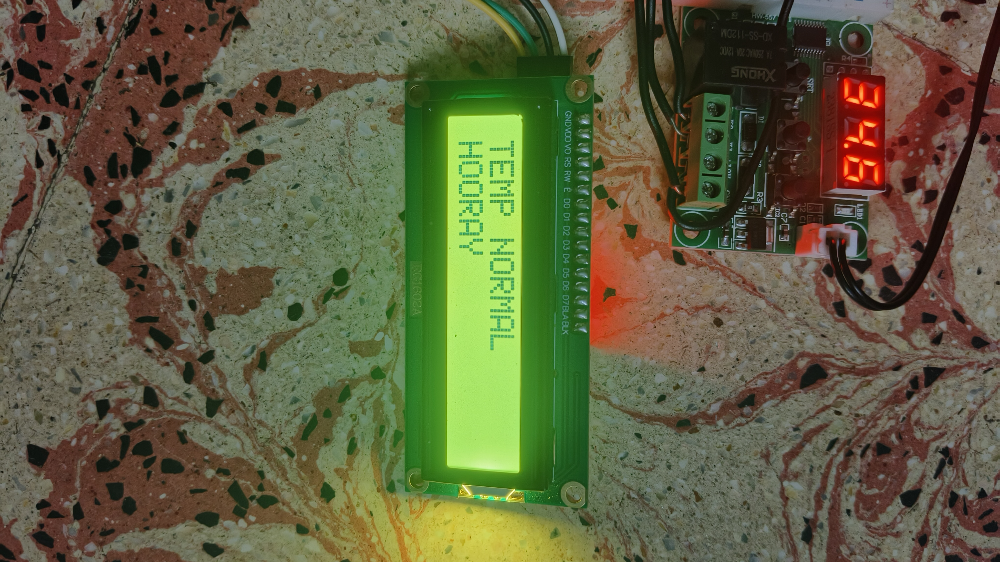
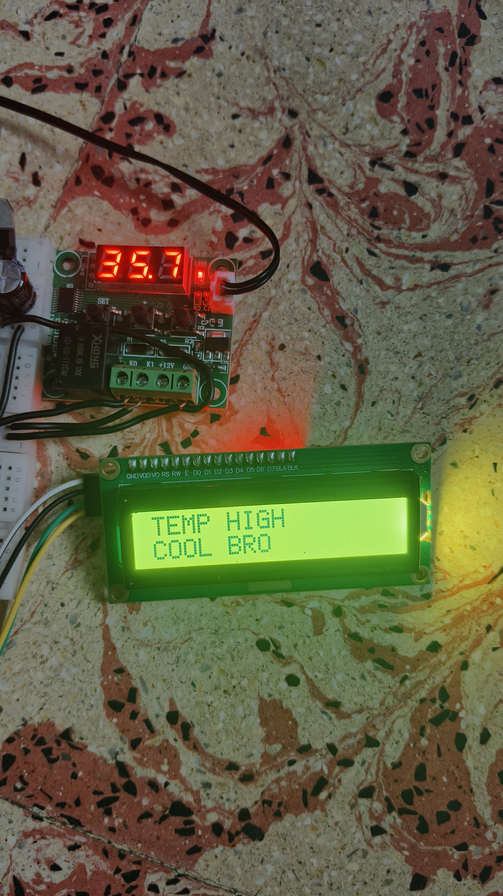

# Temperature-Based Indication System with Regulated Power Supply and Relay

## 📌 Objective
To design a system that measures temperature conditions and indicates whether the temperature is normal or high using Arduino, relay logic, and an LCD display.

---

## 🧰 Components Used
- Arduino Nano  
- Temperature Sensor  
- Relay Module  
- 16x2 LCD (I2C)  
- Transformer  
- Bridge Rectifier  
- Voltage Regulators (7805, 7812)  
- Capacitors, Diodes, Resistors  

---

## ⚙️ System Overview
The project integrates a regulated power supply, temperature sensing, relay-based signal processing, and Arduino-based display.

- 12V supply → Temperature sensing circuit  
- 5V supply → Arduino Nano + LCD  
- Relay converts temperature condition into digital signal  
- Arduino reads signal and displays output  

---

## 🔌 Working Principle
1. AC input is stepped down using a transformer  
2. Rectifier converts AC to DC  
3. Filters smooth the output using capacitors  
4. Voltage regulators generate:
   - 5V for Arduino and LCD  
   - 12V for sensor circuit  
5. Temperature sensor detects ambient temperature  
6. Relay outputs:
   - HIGH → Temperature above threshold  
   - LOW → Temperature below threshold  
7. Arduino reads relay output  
8. LCD displays corresponding message  

---

## 📸 Project Images

### Setup

### Normal Condition

### High Temperature Condition

---

## 🖥️ Output
- **TEMP NORMAL → FAN OFF**  
- **TEMP HIGH → FAN ON**  

> ⚠️ Note: FAN ON/OFF is only an indication. No actual fan is connected.

---

## 📊 Results

| Condition              | Relay Output | LCD Display        |
|----------------------|-------------|--------------------|
| Temperature Low      | LOW         | TEMP NORMAL, FAN OFF |
| Temperature High     | HIGH        | TEMP HIGH, FAN ON   |

---

## 📁 Project Structure

temperature-indication-system/
│
├── README.md
├── LICENSE
│
├── docs/
│ └── report.pdf
│
├── hardware/
│ └── images/
│ ├── setup.jpg
│ ├── lcd_normal.jpg
│ └── lcd_high.jpg
│
├── software/
│ └── arduino_code/
│ └── temp_display.ino
│
├── results/
│ └── observations.txt
